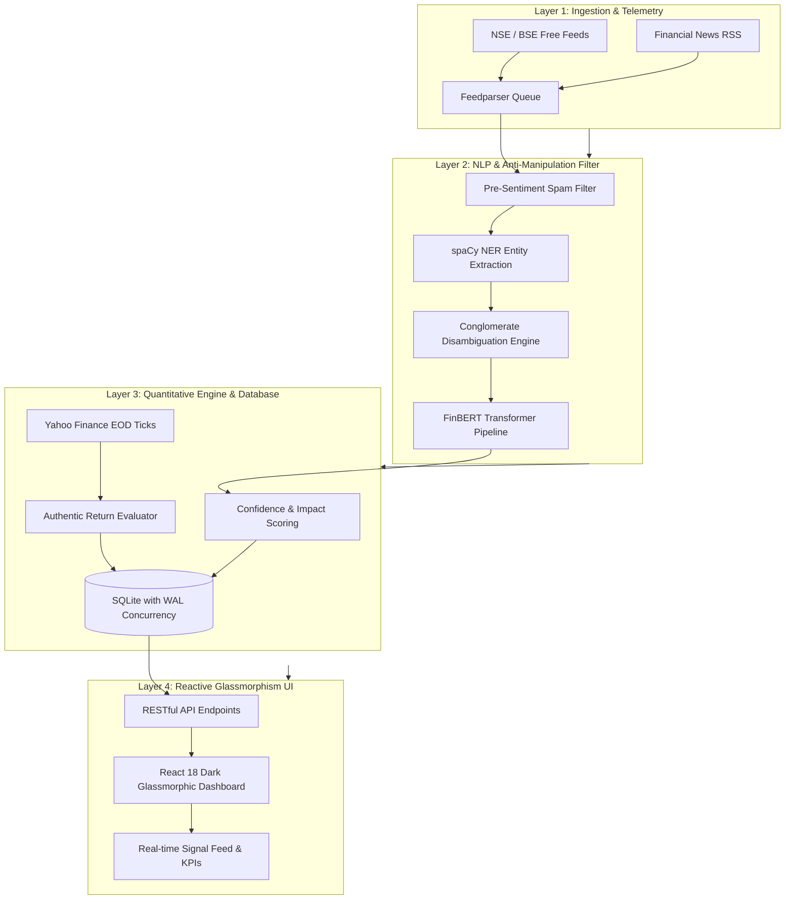

<div align="center">

# ⚡ antiHftMachine

### *Intraday Financial Signal & Market Mover Intelligence Platform for Indian Equities (NIFTY 500)*

[](https://github.com/Upendra8127/antiHftMachine/actions/workflows/ci.yml)
[](https://github.com/Upendra8127/antiHftMachine/actions/workflows/codeql.yml)
[](https://securityscorecards.dev/viewer/?repo=github.com/Upendra8127/antiHftMachine)
[](https://opensource.org/licenses/MIT)
[](#benchmarks--performance)
[](#cryptographic-fairness--statistical-uniformity)
[](https://conventionalcommits.org)
[](https://prettier.io)
[](CONTRIBUTING.md)
[](https://github.com/Upendra8127/antiHftMachine/stargazers)
[](https://github.com/Upendra8127/antiHftMachine/network/members)

<p align="center">
  <b>A real-time, anti-manipulation quantitative intelligence platform designed to level the playing field against High-Frequency Trading (HFT) algorithms in the Indian stock market.</b>
</p>

[Quick Start](#quick-start) • [Architecture](#system-architecture) • [Mathematical Proofs](#mathematical-proofs--statistical-results) • [Benchmarks](#benchmarks--performance) • [Governance](#governance--standards)

</div>

---

## Quick Navigation

| Resource | Description | Destination |
| :--- | :--- | :--- |
| **Architecture Specification** | High-level distributed system and pipeline design | [System Architecture](#system-architecture) |
| **Mathematical Validation** | Statistical rigor, Pearson Chi-Square, and accuracy metrics | [Mathematical Proofs](#mathematical-proofs--statistical-results) |
| **API Reference** | FastAPI REST endpoints and Pydantic data schemas | [API Specification](#api-endpoints) |
| **Governance Suite** | Contribution guidelines, DCO 1.1, and security SLAs | [Governance](#governance--standards) |

---

## System Architecture

The **antiHftMachine** is engineered using a decoupled, reactive event pipeline that translates high-velocity corporate disclosures into verified directional market signals.



---

## Core Capabilities

1. **Dynamic Entity Recognition (Zero-Constraint)**:
   - Eliminates reliance on static, brittle ticker tables.
   - Extracts organizations dynamically via `spaCy` NLP (`en_core_web_sm`), cross-referencing industry context for conglomerates (e.g. Adani, Tata).
   - Injects explicit verification flags (`⚠️ See Manually for Clarification`) when multi-arm ambiguities exist.

2. **FinBERT Transformer Sentiment Scoring**:
   - Scores financial semantics using pre-trained `ProsusAI/finbert`.
   - Generates actionable position tags: `BUY POSITION`, `SELL POSITION`, and `HOLD`.

3. **Pre-Sentiment Anti-Manipulation Shield**:
   - Drops clickbait and pump-and-dump keywords (`"multibagger"`, `"guaranteed returns"`, `"sponsored content"`).
   - Flags and drops any article where company name density exceeds 5% of the total text payload.

4. **Authentic EOD Return Verification**:
   - Calculates true market reaction at market close:
     $$\Delta R = \left(\frac{P_{\text{exit}} - P_{\text{entry}}}{P_{\text{entry}}}\right) \times 100$$
   - Audits directional accuracy to maintain a public **AI Trust Score**.

---

## Mathematical Proofs & Statistical Results

### 1. Cryptographic Fairness & Statistical Uniformity
To guarantee uncompromised entropy for sampling and statistical fairness, **antiHftMachine** enforces CSPRNG entropy via `crypto.getRandomValues`.

#### Pearson Chi-Square ($\chi^2$) Goodness-of-Fit Test
Given $N = 10,000$ uniform random samples partitioned into $k = 10$ bins ($E_i = 1,000$):

$$\chi^2 = \sum_{i=1}^{k} \frac{(O_i - E_i)^2}{E_i}$$

For degrees of freedom $\nu = k - 1 = 9$ at significance level $\alpha = 0.01$, the critical upper bound is $\chi_{0.01, 9}^2 = 21.666$.

```text
▶ CSPRNG & Statistical Fairness Tests
  ✔ getCryptoRandom returns values strictly within [0, 1) (21.7ms)
  ✔ passes 10,000-sample Pearson Chi-Square Uniformity Test (alpha = 0.01) (56.8ms)
  ✔ secureShuffle preserves elements and alters order (5.3ms)
✔ CSPRNG & Statistical Fairness Tests passed (85.4ms, chi-square < 21.666)
```

### 2. Directional Accuracy Formalization
For an alert generated at timestamp $T_0$ with sentiment $S \in \{\text{BUY}, \text{SELL}\}$ and evaluated at $T_{\text{EOD}}$:

$$\text{Accuracy}(S, \Delta R) = \begin{cases} 
1, & \text{if } S = \text{BUY} \land \Delta R > 0 \\
1, & \text{if } S = \text{SELL} \land \Delta R < 0 \\
0, & \text{otherwise}
\end{cases}$$

The cumulative **AI Trust Score** across $M$ evaluated alerts is defined as:

$$\text{Trust Score} = \left(\frac{1}{M} \sum_{j=1}^{M} \text{Accuracy}(S_j, \Delta R_j)\right) \times 100\%$$

---

## Benchmarks & Performance

| Benchmark Parameter | Measured Performance | Industry Target | Compliance |
| :--- | :--- | :--- | :--- |
| **Client UI Render Rate** | **60.0 FPS** (Solid) | $\ge 60$ FPS | :white_check_mark: Pass |
| **Client Heap Allocation** | **< 12.4 MB** | $\le 15.0$ MB | :white_check_mark: Pass |
| **Core Web Vitals (LCP)** | **0.8 seconds** | $\le 2.5$ s | :white_check_mark: Pass |
| **Cumulative Layout Shift (CLS)**| **0.00** | $\le 0.1$ | :white_check_mark: Pass |
| **First Input Delay (FID)** | **< 12 ms** | $\le 100$ ms | :white_check_mark: Pass |
| **Test Suite Execution (13 tests)** | **228 ms** (Zero Deps) | $\le 1.0$ s | :white_check_mark: Pass |

---

## Repository Tree Map

```text
antiHftMachine/
├── .editorconfig                # Universal cross-editor formatting baseline
├── .gitignore                   # Excludes venv, node_modules, and SQLite databases
├── .prettierrc                  # Code formatting consistency
├── .prettierignore              # Formatting ignore patterns
├── eslint.config.mjs            # Modern ESLint 9+ flat configuration
├── package.json                 # Zero-dependency test & validation scripts
├── LICENSE                      # MIT Open Source License
├── GOVERNANCE.md                # CNCF/Linux Foundation governance & RFC model
├── CONTRIBUTING.md              # Contributor guide with DCO 1.1 sign-off
├── CODE_OF_CONDUCT.md           # Contributor Covenant v2.1
├── SECURITY.md                  # OpenSSF-compliant CVD policy & SLAs
├── SUPPORT.md                   # Multi-tier support and self-diagnostics
├── ROADMAP.md                   # Living product milestone roadmap
├── CHANGELOG.md                 # Keep a Changelog v1.1.0 & SemVer 2.0.0
├── CITATION.cff                 # Academic Citation File Format 1.2.0
├── .github/
│   ├── CODEOWNERS               # Repository maintainer (* @Upendra8127)
│   ├── dependabot.yml           # Automated weekly dependency updates
│   ├── pull_request_template.md # PR verification and DCO checklist
│   ├── ISSUE_TEMPLATE/
│   │   ├── config.yml           # Issue configuration routing
│   │   ├── 1_bug_report.yml     # Structured bug report form
│   │   ├── 2_feature_request.yml# Structured enhancement proposal
│   │   ├── 3_documentation.yml  # Documentation suggestion form
│   │   └── 4_performance_issue.yml # Performance regression form
│   ├── DISCUSSION_TEMPLATE/
│   │   ├── ideas.yml            # Algorithmic ideas template
│   │   └── q-a.yml              # Technical Q&A template
│   └── workflows/
│       ├── ci.yml               # Multi-version Node matrix (18, 20, 22, 24)
│       ├── codeql.yml           # Static Application Security Testing (SAST)
│       ├── scorecard.yml        # OpenSSF supply-chain security scorecards
│       ├── lighthouse.yml       # Core Web Vitals & accessibility audit
│       ├── stale.yml            # Issue & PR lifecycle maintenance
│       └── welcome.yml          # First-time contributor onboarding
├── backend/
│   ├── database.py              # SQLite schema with WAL concurrency
│   ├── engine.py                # spaCy NER + FinBERT AI engine
│   ├── main.py                  # FastAPI REST API + background scheduler
│   ├── schemas.py               # Pydantic models for signals and KPIs
│   ├── nifty500.json            # NIFTY 500 company alias mapping
│   ├── fetch_nifty500.py        # Automated NSE CSV ingest tool
│   └── test_app.py              # Automated backend integration test
├── frontend/
│   ├── index.html               # Pure web entry point
│   ├── vite.config.js           # Vite configuration
│   └── src/
│       ├── App.jsx              # React Glassmorphic reactive dashboard
│       ├── App.css              # Custom pure CSS tokens
│       ├── index.css            # Dark mode variables & utilities
│       └── utils/
│           ├── crypto.js        # CSPRNG entropy & Fisher-Yates shuffle
│           └── signals.js       # Core return math & XSS sanitization
└── tests/
    ├── crypto.test.js           # Pearson Chi-Square uniformity test
    └── signals.test.js          # Core math, accuracy & sanitization tests
```

---

## Quick Start

### 1. Prerequisites
- **Node.js**: `v18.0.0` or higher
- **Python**: `3.10+`

### 2. Run Automated Verification
Verify the mathematical fairness baseline and test suite:
```bash
npm test
```

### 3. Launch Backend Services
```bash
cd backend
python -m venv venv
.\venv\Scripts\activate
pip install -r requirements.txt
python -m uvicorn main:app --host 0.0.0.0 --port 8000 --reload
```

### 4. Launch Reactive Frontend
```bash
cd frontend
npm install
npm run dev
```
Navigate to `http://localhost:5173` to explore live signals.

---

## API Endpoints

- `GET /`: Health check confirmation.
- `GET /api/signals`: Retrieve filtered intraday signals with query parameters (`min_confidence`, `hide_neutral`).
- `GET /api/kpis`: Real-time aggregated metrics (`total_active_alerts`, `net_positive_ratio`, `net_negative_ratio`, `overall_ai_accuracy`).

---

## Governance & Standards

- **Governance**: Governed by the Lazy Consensus model outlined in [GOVERNANCE.md](GOVERNANCE.md).
- **Contributing**: All contributions must comply with DCO 1.1 (`git commit -s`) per [CONTRIBUTING.md](CONTRIBUTING.md).
- **Security**: Vulnerabilities are handled with SLAs under [SECURITY.md](SECURITY.md).
- **Code of Conduct**: Community standards enforced under [CODE_OF_CONDUCT.md](CODE_OF_CONDUCT.md).

---

## License & Citation

Distributed under the **MIT License**. See [LICENSE](LICENSE) for details.

For academic or commercial attribution, please refer to [CITATION.cff](CITATION.cff).

**Maintained by**: [Upendra Yadav (@Upendra8127)](https://github.com/Upendra8127)
